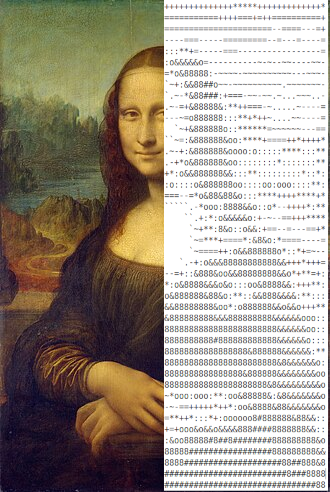

<div align="center">
  
</div>


# artscii

Image to ASCII Art in the name of learning by doing.

## How to Use

First, clone the repository to any folder you like. Then open a Python file or the Python shell in that folder and run:

```python
import artscii
```

Now have fun experimenting! For example, try:

```python
artscii.print_to_console(artscii.convert(artscii.image_from_path("test1.png")))
```

## Documentation

```python
def convert(image, palette: dict = json.loads(default_palette), scale: float = 0.1, font_ratio: float = 0.45, res_path: str = False, darkmode: bool = False):
```

* **image** → Load an image from a file or the web using
  `artscii.load_from_path(path: str)` or `artscii.load_from_url(url: str)`
* **palette** → Defaults to the built-in palette with 15 items.
  You can load your own using `artscii.load_palette(path)`.
* **scale** → How much to downscale the original image.
* **font_ratio** → Adjusts for font aspect ratio so the result doesn’t appear stretched.
* **res_path** → Optional path to save the resulting ASCII art.
* **darkmode** → Boolean that inverts the result for dark-mode text viewers.

Reference [test.py](test.py) for some example usage.

## Ideas

- [ ] Add colors
- [ ] Creation of palettes for different fonts
- [ ] Flask Web interface?